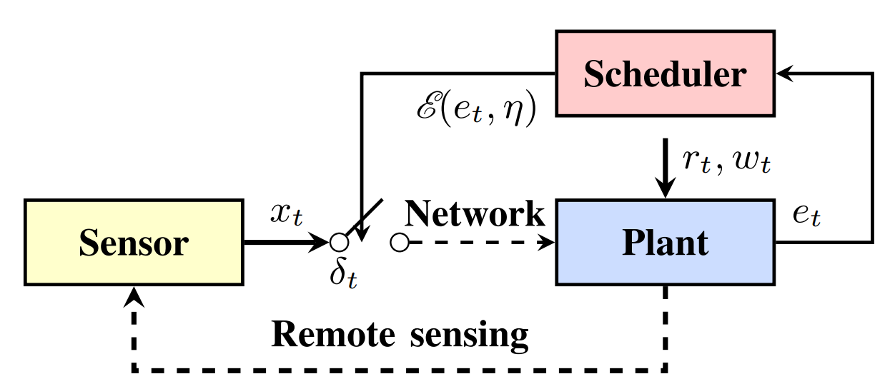
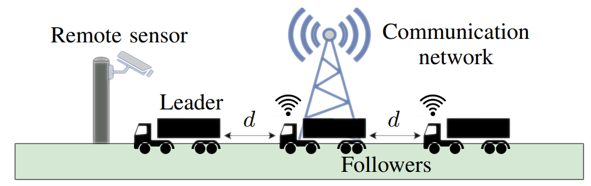
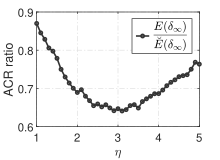
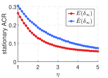

# Average Communication Rate for Networked Event-Triggered Stochastic Control Systems

**Author:** ***Zengjie Zhang*** (z.zhang3@tue.nl)

The simulation studies for the research work [https://arxiv.org/abs/2301.05445](https://arxiv.org/abs/2301.05445)

## Introduction

Networked event-triggered stochastic control system (NET-SCS) have been widely used in collaborative manufacturing, smart power grids, and autonomous traffic management. The event-based mechanism allows the system to allocate the communication resources efficiently. The general structure of a NET-SCS is illustrated in **Fig. 1**, where the network communication is only enabled when a certain event $\mathscr{E}$ is triggered. A typical triggered event is that a certain error of the system exceeds a constant threshold.



**Figure 1. The structure of a NET-SCS.**

An important metric to evaluate the efficiency of the network resource usage is Average Communication Rate (ACR) which is defined as the probability of enabled communication at a certain time. Nevertheless, computing ACR with constant thresholds is nontrivial due to the truncated probabilistic propagation of the communication status. The conventional work uses Gaussian distributions to approximate the ACR by ignoring the truncation operations, leading to overestimated values. Incorrect ACR values may cause errors to the system design, leading to possible failure or damages to the system.

### Approach

This project utilizes a recursive equation to precisely characterize the evolution of ACR as time increases. Based on this recursive model, we have provided analytical and numerical approaches to precisely calculate ACR for constant thresholds. The precise value of ACR can facilitate the correct design of NET-SCSs. 

Taking a leader-follower autonomous driving scenario (platooning) as shown in **Fig 2** as an example, where two vehicles are required to follow a leading vehicle while maintaining a constant distance $d$. The sensor that perceives the positions of the vehicles are deployed remotely and are connected with the vehicles via a wireless network. Each vehicle can estimate the positions of other vehicles. The remote sensor can save the communication bandwidth by disabling the communication to a certain vehicle when its estimation error is smaller than a constant threshold. 



**Figure 2. A leader-follower autonomous driving example.**

In this example, the change of ACR as the threshold $\eta$ increases is illustrated as **Fig. 3**. It clearly shows that the conventional approximation method $\breve{E}$ always overestimate the true value of ACR $E$. Refer to the associated publication for details.




**Figure 3. The change of ACR as the threshold $\eta$ increases.**

## Installation

### Requirements

- Operating System: `Windows`, `Linux`, `MacOS`;
- MATLAB: no version requirements
    - The [Statistics and Machine Learning Toolbox](https://nl.mathworks.com/products/statistics.html).

### Quick Run

#### Run the simple numerical example

- Run the `numerical_main.m` file to inspect the probabilistic propagation of ACR;
```
numerical_main
```

#### The platooning case

- Run the `platooning_main.m` file to compare the calculation results between the conventional method and the proposed method for the platooning scenario;
```
platooning_main
```

